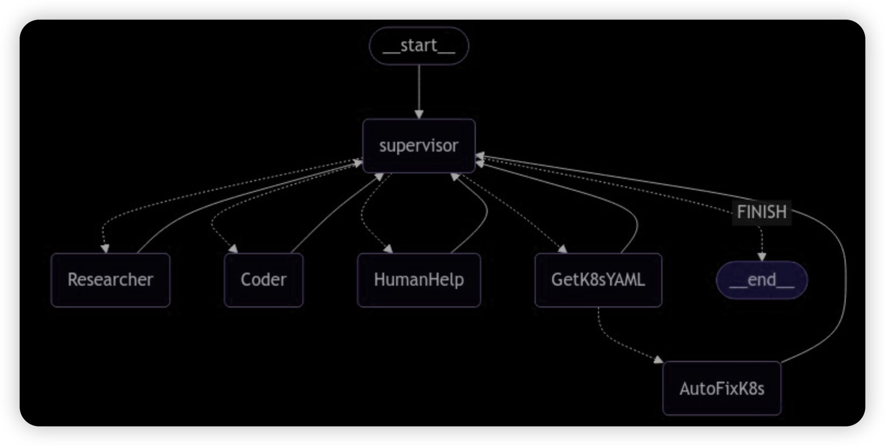

# 作业
1. 尝试提出两个问题，实现将任务调度给 Coder Agent 和 Researcher Agent
   1. 使用 python 编译一段代码
   2. 搜索一下当前 nginx 最新的的版本，并替换
2. 解耦 AutoFixK8s Agent，创建一个新的 Agent，命名为 GetK8sYAML Agent，将获取 YAML 的功能拆分至该 Agent，并将串联自动修复流程，截图

