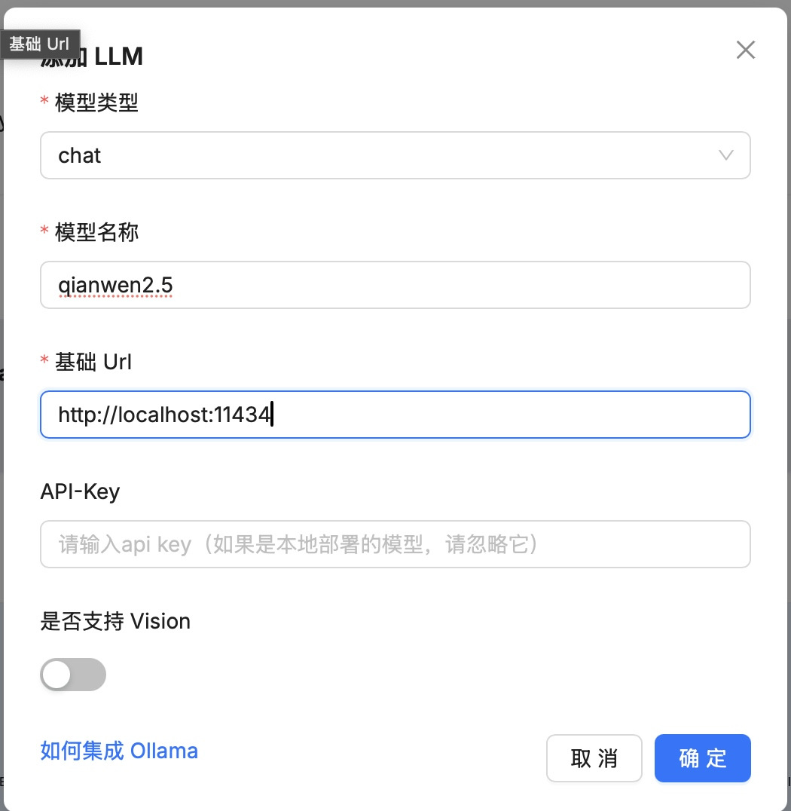
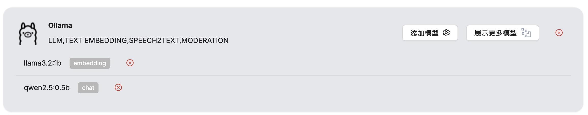
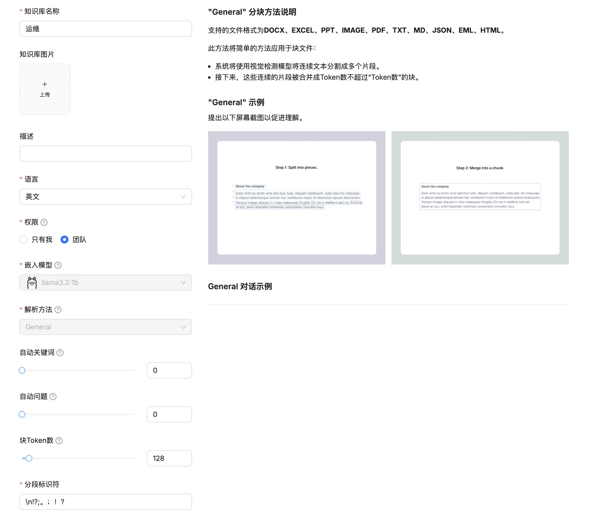
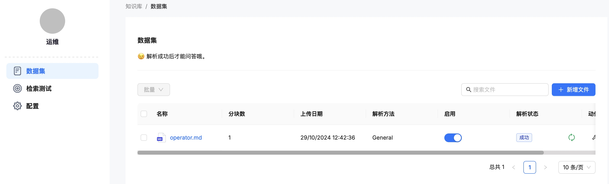
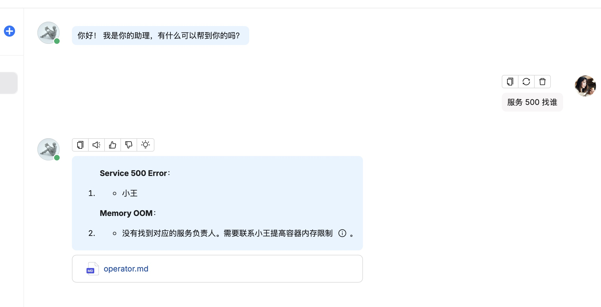

# 作业
## [尝试修改实战三，并接入 Ollama 实现自托管大模型（Qwen2）推理](./logpilot/operator/internal/controller/logpilot_controller.go)

## 修改实战四，配置 RagFlow 接入 Ollama 实现自托管大模型推理
1. terraform 部署环境
    ```shell
    ❯ terraform init     
    ❯ terraform apply -auto-approve
    
    ...
    Apply complete! Resources: 4 added, 0 changed, 0 destroyed.
    
    Outputs:
    
    public_ip = "43.154.180.148"
    ragflow_ip = "http://43.154.180.148"
    vm_password = "password123"
    ```

1. 登陆 43.154.180.148，部署 ollama
    ```shell
    curl -fsSL https://ollama.com/install.sh | sh
    ```

1. 启动 ollama
    ```shell
    root@VM-0-15-ubuntu:~# ollama run llama3.2:1b
    ```

4. 配置 rag
    
    
    
    
    
